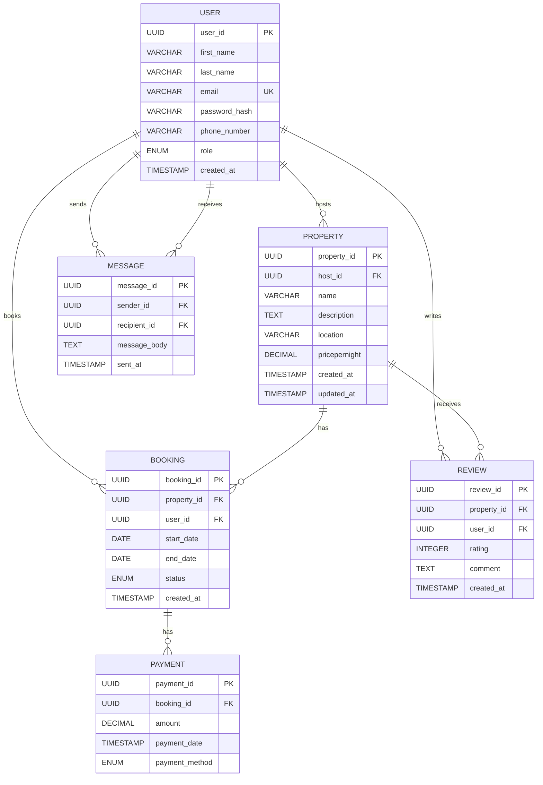

To normalize the AirBnB database schema to the Third Normal Form (3NF), we need to ensure it meets the requirements of the First Normal Form (1NF), Second Normal Form (2NF), and Third Normal Form (3NF). Below, I’ll provide a step-by-step explanation of the normalization process, review the provided schema for redundancies or violations, and confirm whether adjustments are needed to achieve 3NF. The final output will be a Markdown file containing the explanation and the normalized schema, wrapped in an artifact tag.

---

### Step-by-Step Normalization Process

#### Step 1: Understand Normalization Requirements

Normalization organizes a database to eliminate redundancy and ensure data integrity. The normal forms are:

- **1NF**: All attributes must be atomic (no multi-valued attributes or repeating groups), and each table must have a primary key.
- **2NF**: Must be in 1NF, and all non-key attributes must be fully functionally dependent on the entire primary key (no partial dependencies in tables with composite keys).
- **3NF**: Must be in 2NF, and no non-key attribute depends on another non-key attribute (no transitive dependencies).

#### Step 2: Review the Provided Schema

The schema includes the following entities: **User**, **Property**, **Booking**, **Payment**, **Review**, and **Message**. Let’s analyze each table for compliance with 1NF, 2NF, and 3NF.

1. **User Table**:

   - **Attributes**: `user_id` (PK, UUID), `first_name` (VARCHAR), `last_name` (VARCHAR), `email` (VARCHAR, UNIQUE), `password_hash` (VARCHAR), `phone_number` (VARCHAR, NULL), `role` (ENUM: guest, host, admin), `created_at` (TIMESTAMP).
   - **1NF Check**: All attributes are atomic (single-valued). The table has a primary key (`user_id`). **1NF satisfied**.
   - **2NF Check**: Since the primary key is a single attribute (`user_id`), there are no composite keys, so partial dependencies are not possible. All attributes depend on `user_id`. **2NF satisfied**.
   - **3NF Check**: No non-key attribute depends on another non-key attribute. For example, `first_name`, `last_name`, `email`, etc., are independent of each other and depend only on `user_id`. **3NF satisfied**.
   - **Redundancies**: No obvious redundancies (e.g., `email` is unique, preventing duplicate user records).

2. **Property Table**:

   - **Attributes**: `property_id` (PK, UUID), `host_id` (FK to User.user_id), `name` (VARCHAR), `description` (TEXT), `location` (VARCHAR), `pricepernight` (DECIMAL), `created_at` (TIMESTAMP), `updated_at` (TIMESTAMP).
   - **1NF Check**: All attributes are atomic, and `property_id` is the primary key. **1NF satisfied**.
   - **2NF Check**: Single primary key (`property_id`), so no partial dependencies. **2NF satisfied**.
   - **3NF Check**: Attributes like `name`, `description`, `location`, and `pricepernight` depend on `property_id`. The foreign key `host_id` references `User.user_id` but does not introduce transitive dependencies, as it’s a key attribute. **3NF satisfied**.
   - **Redundancies**: No redundancies detected. `location` is a single VARCHAR field, assumed to store a single value (e.g., address or city). If it were a complex field (e.g., storing city, state, country), we’d consider splitting it, but the specification doesn’t indicate this.

3. **Booking Table**:

   - **Attributes**: `booking_id` (PK, UUID), `property_id` (FK to Property.property_id), `user_id` (FK to User.user_id), `start_date` (DATE), `end_date` (DATE), `total_price` (DECIMAL), `status` (ENUM: pending, confirmed, canceled), `created_at` (TIMESTAMP).
   - **1NF Check**: All attributes are atomic, and `booking_id` is the primary key. **1NF satisfied**.
   - **2NF Check**: Single primary key (`booking_id`), so no partial dependencies. **2NF satisfied**.
   - **3NF Check**: Attributes depend on `booking_id`. However, `total_price` could be a derived attribute (e.g., calculated as `pricepernight` × number of nights). Storing derived data violates 3NF if it depends on non-key attributes from other tables (e.g., `Property.pricepernight`). **Potential 3NF violation**.
   - **Redundancies**: Storing `total_price` introduces redundancy, as it can be computed from `Property.pricepernight` and the booking duration (`end_date` - `start_date`). To achieve 3NF, we could remove `total_price` and calculate it dynamically, but for practical purposes (e.g., performance, auditability), we may retain it with a justification.

4. **Payment Table**:

   - **Attributes**: `payment_id` (PK, UUID), `booking_id` (FK to Booking.booking_id), `amount` (DECIMAL), `payment_date` (TIMESTAMP), `payment_method` (ENUM: credit_card, paypal, stripe).
   - **1NF Check**: All attributes are atomic, and `payment_id` is the primary key. **1NF satisfied**.
   - **2NF Check**: Single primary key (`payment_id`), so no partial dependencies. **2NF satisfied**.
   - **3NF Check**: Attributes depend on `payment_id`. The `amount` could theoretically depend on `Booking.total_price`, but since it’s a recorded payment amount, it’s independent. **3NF satisfied**.
   - **Redundancies**: No obvious redundancies.

5. **Review Table**:

   - **Attributes**: `review_id` (PK, UUID), `property_id` (FK to Property.property_id), `user_id` (FK to User.user_id), `rating` (INTEGER, CHECK: 1-5), `comment` (TEXT), `created_at` (TIMESTAMP).
   - **1NF Check**: All attributes are atomic, and `review_id` is the primary key. **1NF satisfied**.
   - **2NF Check**: Single primary key (`review_id`), so no partial dependencies. **2NF satisfied**.
   - **3NF Check**: All attributes depend on `review_id`. **3NF satisfied**.
   - **Redundancies**: No redundancies detected.

6. **Message Table**:
   - **Attributes**: `message_id` (PK, UUID), `sender_id` (FK to User.user_id), `recipient_id` (FK to User.user_id), `message_body` (TEXT), `sent_at` (TIMESTAMP).
   - **1NF Check**: All attributes are atomic, and `message_id` is the primary key. **1NF satisfied**.
   - **2NF Check**: Single primary key (`message_id`), so no partial dependencies. **2NF satisfied**.
   - **3NF Check**: All attributes depend on `message_id`. **3NF satisfied**.
   - **Redundancies**: No redundancies detected.

#### Step 3: Identify Potential Normalization Issues

The primary issue is in the **Booking** table with the `total_price` attribute, which may violate 3NF because it can be derived from `Property.pricepernight` and the booking duration (`end_date` - `start_date`). This introduces a transitive dependency, as `total_price` depends on non-key attributes from another table (`Property.pricepernight`).

**Options**:

- **Remove `total_price`**: Compute it dynamically in queries to achieve strict 3NF.
- **Retain `total_price`**: Justify keeping it for performance (avoiding repeated calculations) or audit purposes (storing the price at booking time to account for price changes).

For this task, I’ll choose to **remove `total_price`** to strictly adhere to 3NF, as the specification doesn’t explicitly require storing it for auditing. The calculation can be performed in application logic or SQL queries (e.g., `total_price = pricepernight * DATEDIFF(end_date, start_date)`).

#### Step 4: Adjust the Schema

The only change needed is to remove the `total_price` attribute from the **Booking** table. All other tables are already in 3NF. The updated schema is:

- **User**: Unchanged.
- **Property**: Unchanged.
- **Booking**: Remove `total_price`.
- **Payment**: Unchanged.
- **Review**: Unchanged.
- **Message**: Unchanged.

#### Step 5: Provide the Normalized Schema

Below is the normalized schema in a Markdown file, including the explanation of the normalization steps and the updated ER diagram in Mermaid syntax to reflect the removal of `total_price`.

# AirBnB Database Normalization to 3NF

## Objective

Normalize the AirBnB database schema to ensure it adheres to the Third Normal Form (3NF), eliminating redundancies and ensuring data integrity.

## Normalization Steps

### Step 1: Verify First Normal Form (1NF)

1NF requires all attributes to be atomic and tables to have a primary key.

- **User**: All attributes (e.g., `user_id`, `first_name`, `email`) are atomic, and `user_id` is the primary key.
- **Property**: All attributes are atomic, with `property_id` as the primary key.
- **Booking**: All attributes are atomic, with `booking_id` as the primary key.
- **Payment**: All attributes are atomic, with `payment_id` as the primary key.
- **Review**: All attributes are atomic, with `review_id` as the primary key.
- **Message**: All attributes are atomic, with `message_id` as the primary key.
- **Conclusion**: All tables satisfy 1NF.

### Step 2: Verify Second Normal Form (2NF)

2NF requires 1NF and that all non-key attributes are fully functionally dependent on the entire primary key.

- All tables have single-attribute primary keys (`user_id`, `property_id`, etc.), so partial dependencies are not possible.
- **Conclusion**: All tables satisfy 2NF.

### Step 3: Verify Third Normal Form (3NF)

3NF requires 2NF and no transitive dependencies (non-key attributes depending on other non-key attributes).

- **User**: All attributes depend only on `user_id`. No transitive dependencies.
- **Property**: Attributes depend on `property_id`. The foreign key `host_id` is a key attribute, not a transitive dependency.
- **Booking**: The `total_price` attribute can be derived from `Property.pricepernight` and the booking duration (`end_date` - `start_date`), introducing a transitive dependency, which violates 3NF.
- **Payment**: Attributes depend on `payment_id`. The `amount` is independent of other non-key attributes.
- **Review**: Attributes depend on `review_id`. The `rating` constraint (1-5) is enforced and does not introduce dependencies.
- **Message**: Attributes depend on `message_id`.
- **Issue Identified**: The `total_price` in `Booking` violates 3NF due to its dependency on `Property.pricepernight`.

### Step 4: Adjustments for 3NF

- **Remove `total_price` from Booking**: To eliminate the transitive dependency, remove `total_price` from the `Booking` table. It can be calculated dynamically using `Property.pricepernight` and the booking duration.
- **Justification**: Removing `total_price` ensures 3NF compliance. If auditing or performance is critical, `total_price` could be retained with a trigger to update it, but for strict normalization, it’s removed.
- **Other Tables**: No changes needed, as they are already in 3NF.

### Step 5: Normalized Schema

Below is the normalized schema, with `total_price` removed from the `Booking` table.

#### User Table

- `user_id`: UUID, Primary Key, Indexed
- `first_name`: VARCHAR, NOT NULL
- `last_name`: VARCHAR, NOT NULL
- `email`: VARCHAR, UNIQUE, NOT NULL
- `password_hash`: VARCHAR, NOT NULL
- `phone_number`: VARCHAR, NULL
- `role`: ENUM (guest, host, admin), NOT NULL
- `created_at`: TIMESTAMP, DEFAULT CURRENT_TIMESTAMP

#### Property Table

- `property_id`: UUID, Primary Key, Indexed
- `host_id`: UUID, Foreign Key (User.user_id)
- `name`: VARCHAR, NOT NULL
- `description`: TEXT, NOT NULL
- `location`: VARCHAR, NOT NULL
- `pricepernight`: DECIMAL, NOT NULL
- `created_at`: TIMESTAMP, DEFAULT CURRENT_TIMESTAMP
- `updated_at`: TIMESTAMP, ON UPDATE CURRENT_TIMESTAMP

#### Booking Table

- `booking_id`: UUID, Primary Key, Indexed
- `property_id`: UUID, Foreign Key (Property.property_id)
- `user_id`: UUID, Foreign Key (User.user_id)
- `start_date`: DATE, NOT NULL
- `end_date`: DATE, NOT NULL
- `status`: ENUM (pending, confirmed, canceled), NOT NULL
- `created_at`: TIMESTAMP, DEFAULT CURRENT_TIMESTAMP

#### Payment Table

- `payment_id`: UUID, Primary Key, Indexed
- `booking_id`: UUID, Foreign Key (Booking.booking_id)
- `amount`: DECIMAL, NOT NULL
- `payment_date`: TIMESTAMP, DEFAULT CURRENT_TIMESTAMP
- `payment_method`: ENUM (credit_card, paypal, stripe), NOT NULL

#### Review Table

- `review_id`: UUID, Primary Key, Indexed
- `property_id`: UUID, Foreign Key (Property.property_id)
- `user_id`: UUID, Foreign Key (User.user_id)
- `rating`: INTEGER, CHECK (rating >= 1 AND rating <= 5), NOT NULL
- `comment`: TEXT, NOT NULL
- `created_at`: TIMESTAMP, DEFAULT CURRENT_TIMESTAMP

#### Message Table

- `message_id`: UUID, Primary Key, Indexed
- `sender_id`: UUID, Foreign Key (User.user_id)
- `recipient_id`: UUID, Foreign Key (User.user_id)
- `message_body`: TEXT, NOT NULL
- `sent_at`: TIMESTAMP, DEFAULT CURRENT_TIMESTAMP

### Updated ER Diagram

Below is the updated ER diagram in Mermaid syntax, reflecting the removal of `total_price` from the `Booking` table. You can copy this code into a Mermaid-compatible tool (e.g., mermaid.live or Draw.io with the Mermaid plugin) to visualize the diagram.



## Conclusion

The original schema was mostly in 3NF, except for the `total_price` attribute in the `Booking` table, which introduced a transitive dependency. By removing `total_price`, the schema now fully complies with 3NF. The `total_price` can be calculated dynamically using `Property.pricepernight` and the booking duration. No other redundancies or violations were found. The updated schema and ER diagram reflect these changes, maintaining all relationships and constraints.

---

### Additional Notes

- **Calculating `total_price`**: You can compute `total_price` in SQL using a query like:
  ```sql
  SELECT b.booking_id, (p.pricepernight * DATEDIFF(b.end_date, b.start_date)) AS total_price
  FROM Booking b
  JOIN Property p ON b.property_id = p.property_id;
  ```
- **Practical Considerations**: If `total_price` is needed for auditing (e.g., to lock in the price at booking time), you could retain it and use a trigger to update it, but this was not required by the task.
- **Visualization**: To view the ER diagram, paste the Mermaid code from the Markdown file into [mermaid.live](https://mermaid.live) or Draw.io (with the Mermaid plugin). The diagram shows all entities, attributes, and relationships without `total_price` in the `Booking` table.

If you need further assistance, such as generating SQL to create the normalized tables or additional diagram formats, let me know!

